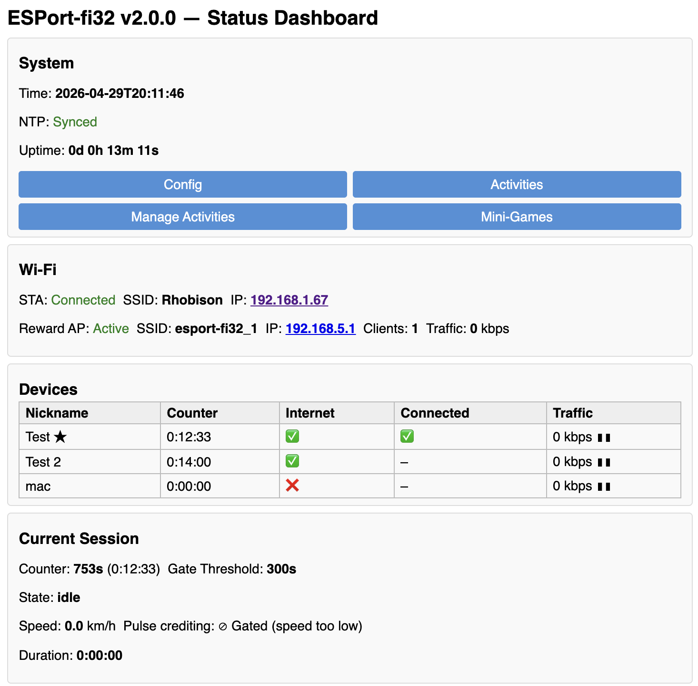
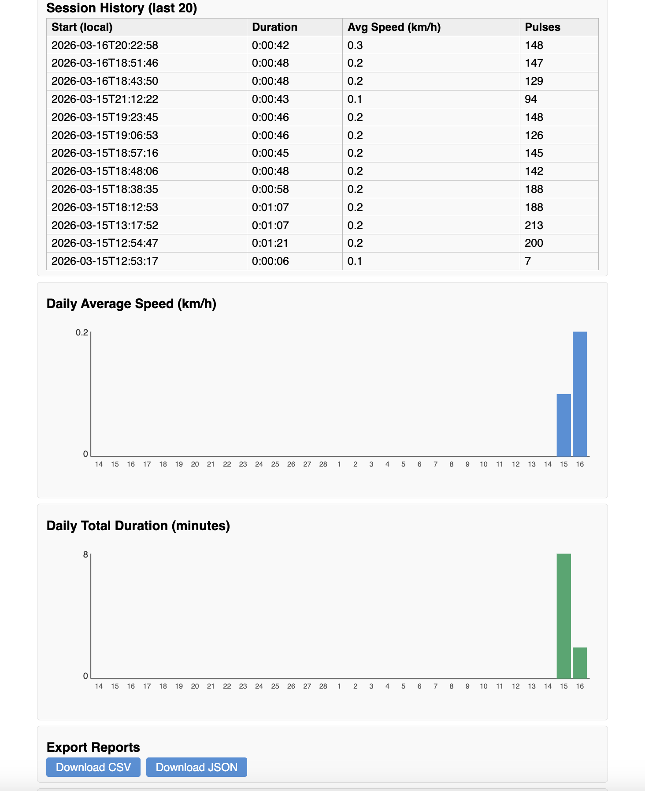
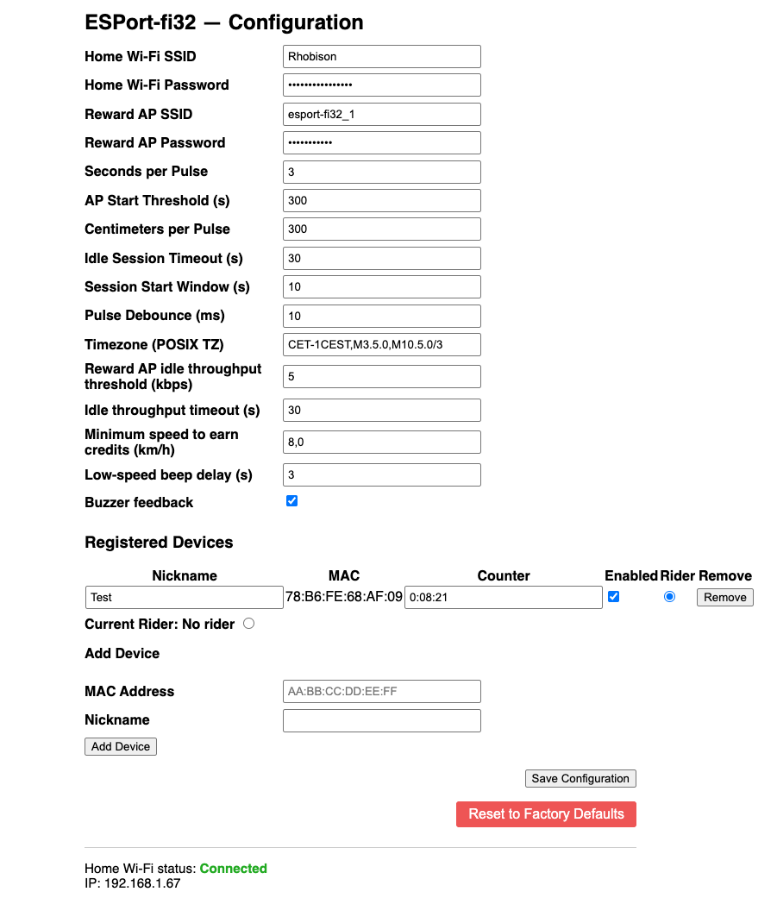

# esport-fi32

**Turn pedalling into internet time — a parental-control firmware for the ESP32-C6.**

esport-fi32 is an ESP-IDF firmware that incentivises children to exercise on a sports/exercise bike by gating Wi-Fi internet access behind time credits earned through physical activity. The more the child pedals, the more internet time they earn. When the credits run out, the Wi-Fi access point shuts down automatically.

---

## How it works

1. **Sensor input** — A bike sensor is wired to a GPIO pin on the ESP32-C6. Every pedal revolution generates a pulse that is counted by the firmware.
2. **Credit accumulation** — Each pulse adds a configurable number of seconds (`seconds_per_pulse`) to a time counter, provided the instantaneous speed meets the configurable minimum (`min_speed_to_increment_time_kmh_x10`). Set the minimum to zero to credit every pulse regardless of speed.
3. **Reward Wi-Fi** — Once continuous pedalling exceeds a warm-up threshold (`soft_ap_start_threshold_s`), the firmware enables a **Reward Soft AP** that acts as a NAT router, giving connected devices access to the internet through the home network.
4. **Countdown** — While the Reward AP is active, the time counter counts down in real time. Continued pedalling replenishes the credits. The countdown pauses automatically when there is no active internet traffic (configurable threshold), so idle screen time does not consume credits.
5. **Access cut-off** — When the counter reaches zero the Reward AP is disabled and internet access is cut off until the child earns more credits.

---

## Features

- **AP + STA simultaneous mode** with NAT — connected devices browse the internet via the home network.
- **Exercise session tracking** — sessions are detected, timed, and stored in NVS as a ring buffer with start time, duration, distance, and average speed.
- **NTP time synchronisation** — date/time is synced at boot; a configurable POSIX timezone string converts UTC timestamps to local time.
- **Always-available configuration portal** — a web UI is reachable via the home network IP or via a dedicated fallback config AP (`esport-fi32_config`) when home network access is unavailable.
- **Live status dashboard** — shows the current counter value, AP state, connected clients, NTP status, session history, bar charts, and export actions.
- **REST JSON API** — for status, session history, CSV/JSON export, and daily activity aggregates (suitable for charts).
- **Speed-gated crediting** — a configurable minimum speed (`min_speed_to_increment_time_kmh_x10`) prevents credits accumulating when pedalling too slowly. The gate is disabled when set to zero.
- **Persistent reward counter** — the time counter is saved to NVS every 60 seconds and immediately on AP shutdown; it is restored at boot so credits survive power cycles.
- **Traffic-gated countdown** — the countdown pauses automatically when no meaningful internet traffic is detected, preventing credits from draining during idle screen time.
- **Fully configurable** — all parameters (SSID, password, seconds-per-pulse, thresholds, timezone, …) are stored in NVS and can be changed at runtime via the web UI without reflashing.

---

## Web UI

The built-in HTTP server provides two pages and a JSON API, accessible from any browser on the same network.

### Status Dashboard (`/`)





Shows in real time:
- Time counter (credits remaining, in h:mm:ss), reward AP throughput, and countdown status (decrementing or paused due to low traffic)
- Current speed and speed-gate status (crediting or gated)
- Reward AP status (on / off) and connected clients
- Current exercise session info (state, qualification progress, live speed)
- NTP sync status and system uptime
- Session history table (last 20 sessions)
- Session bar charts: daily average speed and daily total duration
- Export Reports panel (download CSV or JSON)

### Configuration Page (`/config`)



Lets you set all parameters without reflashing:
- Home Wi-Fi credentials
- Reward AP SSID & password
- Seconds earned per pulse, warm-up threshold
- Minimum speed required to earn credits
- Wheel circumference (for speed calculation)
- Session detection timings, debounce
- Traffic threshold for countdown pause
- Timezone (POSIX TZ string)
- Reward counter (direct credit entry in hh:mm:ss format; setting a non-zero value enables the reward AP immediately)

---

## Hardware

| Item             | Details                                               |
| ---------------- | ----------------------------------------------------- |
| MCU              | ESP32-C6                                              |
| Bike sensor GPIO | GPIO 10 (configurable via `CONFIG_ESPORT_PULSE_GPIO`) |
| GPIO pull        | Internal pull-up (sensor closes to GND)               |
| Active edge      | Falling edge                                          |

Connect the exercise bike's reed switch or hall-effect sensor between **GPIO 10** and **GND**.

---

## Getting Started

### Prerequisites

- [ESP-IDF v5.5.3](https://docs.espressif.com/projects/esp-idf/en/v5.5.3/esp32c6/get-started/) (or compatible v5.x)
- ESP32-C6 development board

### Dev Container (recommended)

A ready-to-use Docker-based development environment is included. It pre-installs ESP-IDF v5.5.3, CMake 4.2.0, Doxygen 1.15.0, and all required toolchains.

1. Install [Docker](https://docs.docker.com/get-docker/) and the [VS Code Dev Containers extension](https://marketplace.visualstudio.com/items?itemName=ms-vscode-remote.remote-containers).
2. Open the repository in VS Code and accept the **Reopen in Container** prompt.
3. The container builds automatically. After it starts, the full ESP-IDF toolchain is available in the integrated terminal.

### Build & Flash

```bash
idf.py set-target esp32c6
idf.py build
idf.py -p PORT flash monitor
```

### First-time configuration

1. On first boot (or when home Wi-Fi credentials are not yet configured) the device creates a fallback AP:
   - **SSID:** `esport-fi32_config`
   - **Password:** `esport-fi32_config`
2. Connect to that network and open **http://192.168.4.1/config** in a browser.
3. Enter your home Wi-Fi credentials, the Reward AP name/password, and any other settings.
4. Save and reboot. The device will connect to your home network.
5. The configuration page remains accessible via the home network IP from that point on.

---

## Configuration Parameters

All parameters are stored in NVS and can be changed at runtime via the web UI.

| Parameter                               | Default | Description                                                                                   |
| --------------------------------------- | ------- | --------------------------------------------------------------------------------------------- |
| `wifi_ssid`                             | `""`    | Home network SSID                                                                             |
| `wifi_password`                         | `""`    | Home network password                                                                         |
| `soft_ap_ssid`                          | `"esport-fi32"` | Reward AP SSID                                                                      |
| `soft_ap_password`                      | `"esport-fi32"` | Reward AP password                                                                  |
| `seconds_per_pulse`                     | `3`     | Seconds of internet time earned per bike pulse                                                |
| `soft_ap_start_threshold_s`             | `300`   | Warm-up pedalling time (s) before AP is enabled                                               |
| `centimeters_per_pulse`                 | `300`    | Wheel travel per pulse (cm), used for speed display                                           |
| `idle_session_interval_s`               | `30`    | Gap (s) with no pulses that closes a session                                                  |
| `start_session_interval_s`              | `10`    | Continuous pedalling (s) required to open a session                                           |
| `pulse_debounce_time_ms`                | `10`    | Minimum time (ms) between two accepted pulses                                                 |
| `timezone`                              | `"UTC0"` | POSIX TZ string (e.g. `CET-1CEST,M3.5.0,M10.5.0/3`)                                        |
| `soft_ap_dec_time_above_threshold_kbps` | `1`     | Traffic threshold (kbps) below which countdown pauses                                         |
| `soft_ap_idle_throughput_timeout_s`     | `30`    | Seconds of low traffic before countdown actually pauses                                        |
| `min_speed_to_increment_time_kmh_x10`   | `30`    | Minimum speed (km/h × 10, e.g. `30` = 3.0 km/h) required for a pulse to earn credits; `0` disables the gate |
| `reward_counter_s`                      | `0`     | Reward counter in seconds, persisted to NVS; setting a non-zero value enables the reward AP immediately |

---

## REST API

| Endpoint               | Method     | Description                   |
| ---------------------- | ---------- | ----------------------------- |
| `/`                    | GET        | Status dashboard (HTML)       |
| `/config`              | GET / POST | Configuration form (HTML)     |
| `/api/status`          | GET        | Live state as JSON            |
| `/api/sessions`        | GET        | Session history as JSON       |
| `/api/sessions/export` | GET        | Download CSV or JSON report   |
| `/api/sessions/daily`  | GET        | Daily aggregates for charting |

---

## Project Structure

```
main/
  inc/                        # Header files for all modules
  src/
    main.c                    # Startup & module initialisation
    config_manager.c          # NVS-backed configuration
    wifi_manager.c            # AP+STA+NAT Wi-Fi management
    time_manager.c            # SNTP / timezone
    pulse_input.c             # GPIO interrupt, debounce & speed calculation
    time_counter.c            # Credit counter & reward AP state machine
    session_tracker.c         # Exercise session detection
    session_log.c             # NVS ring-buffer session log
    http_server.c             # HTTP server core (init, URI registration)
    http_server_utils.c       # Shared HTML/JSON helpers
    http_server_config.c      # GET & POST /config handlers
    http_server_api.c         # GET /api/status and /api/sessions handlers
    http_server_export.c      # GET /api/sessions/export handler
    http_server_dashboard.c   # GET / status dashboard handler
docs/
  1-specification.md          # Full firmware specification
  2-development_plan.md       # Phased development plan
```

