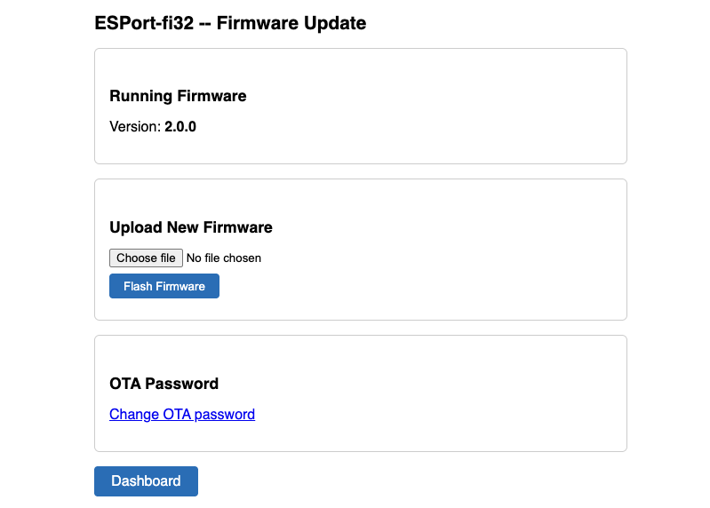
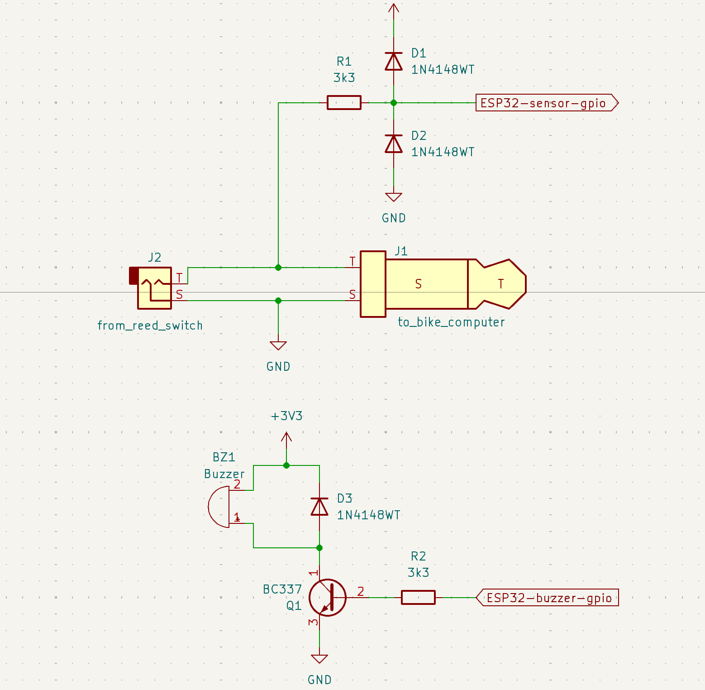
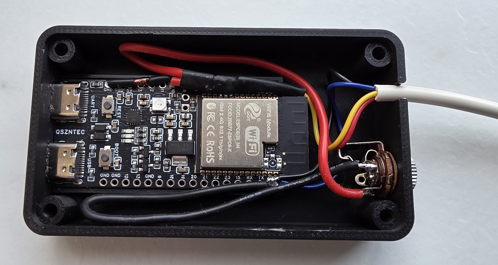
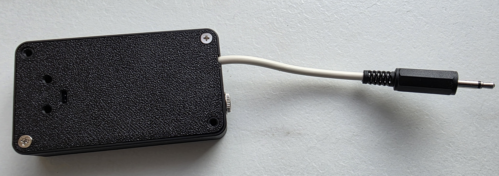

# ESPort-fi32

**Turn pedalling into internet time — a parental-control firmware for the ESP32-C6.**

ESPort-fi32 is an ESP-IDF firmware that incentivises children to exercise on a sports/exercise bike by gating Wi-Fi internet access behind time credits earned through physical activity. The more the child pedals, the more internet time they earn. When the credits run out, internet access is revoked for that device until more credits are earned.

---

## How it works

1. **Sensor input** — A bike sensor is wired to a GPIO pin on the ESP32-C6. Every pedal revolution generates a pulse that is counted by the firmware.
2. **Credit accumulation** — Each pulse adds a configurable number of seconds (`seconds_per_pulse`) to the current rider's time counter, provided the instantaneous speed meets the configurable minimum (`min_speed_to_increment_time_kmh_x10`). Set the minimum to zero to credit every pulse regardless of speed.
3. **Always-on Reward Wi-Fi** — The **Reward Soft AP** is active from boot and acts as a NAT router. Children's devices stay connected at all times and can always reach the gateway (status dashboard, config page). Internet access is gated per device.
4. **Per-device internet gating** — Up to 4 devices can be registered in a **device registry** (MAC address, nickname, individual time counter, enabled toggle). Only registered devices with remaining credits and the enabled flag set can route traffic to the internet. An IP-layer filter silently drops internet-bound packets from unauthorised devices.
5. **Current rider** — A "current rider" selector on the config page binds one registered device to the bike sensor. Credits earned during exercise go to that device's counter.
6. **Countdown** — Each registered device's counter counts down independently (one second per tick) while the device is connected, enabled, and has credits remaining. The countdown pauses automatically per device when there is no active internet traffic (configurable threshold), so idle screen time does not consume credits.
7. **Access cut-off** — When a device's counter reaches zero, internet access is revoked for that device only. The Reward AP stays on and other devices with remaining credits are unaffected.

---

## Features

- **AP + STA simultaneous mode** with NAT — connected devices browse the internet via the home network.
- **Always-on Reward AP** — the Soft AP is active from boot; children's devices stay connected at all times. Internet access is gated per device, not by toggling the AP.
- **Per-device internet access control** — a device registry (up to 4 entries) stores MAC, nickname, individual time counter, and enabled flag per device. An IP-layer filter enforces access: only registered, enabled devices with remaining credits can reach the internet.
- **Current rider selection** — binds the bike sensor to one registered device; earned credits go to that device's counter.
- **Exercise session tracking** — sessions are detected, timed, and stored in NVS as a ring buffer with start time, duration, distance, average speed, and **internet time earned**.
- **NTP time synchronisation** — date/time is synced at boot; a configurable POSIX timezone string converts UTC timestamps to local time.
- **Always-available configuration portal** — a web UI is reachable via the home network IP or via the reward AP (`192.168.5.1`) at all times.
- **Live status dashboard** — shows per-device counters and internet status, AP state, connected clients, NTP status, session history (with internet earned per session), bar charts, and export actions.
- **Firmware versioning** — semantic version (`MAJOR.MINOR.PATCH`) set in `CMakeLists.txt` via `PROJECT_VER`, embedded in the firmware image, and displayed in the dashboard title.
- **Device management on config page** — add, remove, rename devices; set per-device counter (h:mm:ss), toggle enabled, select current rider. Connected but unregistered stations are listed for quick registration (useful when Android MAC randomisation produces an unexpected address).
- **REST JSON API** — for status (including per-device array), session history, CSV/JSON export, and daily activity aggregates (suitable for charts).
- **Speed-gated crediting** — a configurable minimum speed (`min_speed_to_increment_time_kmh_x10`) prevents credits accumulating when pedalling too slowly. The gate is disabled when set to zero.
- **Per-device traffic-gated countdown** — each device's countdown pauses independently when no meaningful internet traffic is detected, preventing credits from draining during idle screen time.
- **Persistent per-device counters** — device registry data is saved to NVS every 60 seconds and on counter-reaching-zero; counters survive power cycles.
- **Firmware Over-The-Air (FOTA) updates** — upload a new `.bin` via the browser at `/ota` (HTTP Basic Auth protected). Automatic rollback: if the device crashes before the new firmware calls `ota_mngr_init()`, the bootloader reverts to the previous slot. Password configurable via `/ota/pwd`.
- **Buzzer feedback** — an active buzzer on a configurable GPIO provides audio cues: a beep on session start, a longer beep on session qualification, a triple-beep on session close, and a repeating short tick when pedalling too slowly (after a configurable delay to avoid false alarms from momentary speed fluctuations). Can be disabled via the config page.
- **Activity Credits** — lets a parent define a pool of up to 30 named activities (e.g. "Bike ride", "Homework"). Each activity carries a configurable internet credit, optional daily time cap, and a per-device daily click limit. Activities are assigned per registered device. A parent opens `/activities` to view and click **Credit** buttons; each click adds internet time to that child's counter and plays a double-ding buzzer pattern (configurable). Credit history is recorded in a per-device ring-buffer log (last 30 entries). Managed via `/activities/manage` and a JSON API at `/api/activities`, `/api/activities/credit`, and `/api/activities/log`.
- **Fully configurable** — all parameters (SSID, password, seconds-per-pulse, thresholds, timezone, ...) are stored in NVS and can be changed at runtime via the web UI without reflashing.

---

## Web UI

The built-in HTTP server provides two pages and a JSON API, accessible from any browser on the same network.

### Status Dashboard (`/`)


Shows in real time:
- Per-device internet status table (nickname, counter, internet active, connected, throughput, pause state)
- Current speed and speed-gate status (crediting or gated)
- Reward AP status and connected clients
- Current exercise session info (state, qualification progress, live speed)
- NTP sync status and system uptime
- Session history table (last 20 sessions)
- Session bar charts: daily average speed and daily total duration
- Export Reports panel (download CSV or JSON)

### Configuration Page (`/config`)


Lets you set all parameters without reflashing:
- Home Wi-Fi credentials
- Reward AP SSID & password
- Seconds earned per pulse, warm-up threshold
- Minimum speed required to earn credits
- Wheel circumference (for speed calculation)
- Session detection timings, debounce
- Traffic threshold for per-device countdown pause
- Timezone (POSIX TZ string)
- Buzzer feedback enable/disable
- **Registered Devices** table: per-device nickname, MAC (read-only), counter (h:mm:ss, editable with auto-format), enabled toggle, current-rider radio, remove button
- **Add Device** form: MAC address input (auto-formatted), nickname
- **Connected Unregistered Stations**: lists AP-connected devices not in the registry with a one-click Add button (handles Android MAC randomisation)

> **Auth:** All `/config` endpoints require HTTP Basic Auth (default credentials: `admin` / `esport-fi32`). Change the password at `/config/pwd`.

### Activity Credits (`/activities`)

A parent-facing credit interface (requires Basic Auth). Select a child from the drop-down to view their assigned activities with **Credit** buttons. Clicking a button adds the activity's configured internet time to the child's counter and plays a double-ding buzzer sound. The page shows the child's total counter (live, fetched from `/api/status`) and a per-session credit log.

### Activity Management (`/activities/manage`)

Requires Basic Auth. Manage the global activity pool (up to 30 activities): create, rename, adjust credit times, daily caps, and click limits. Assign/unassign activities per registered device.

### Firmware Update OTA (`/ota`)



The configuration page includes a **Firmware Update** link (below "Reset to Factory Defaults") that navigates to the OTA page. The OTA page is protected by HTTP Basic Auth (default credentials: `admin` / `esport-fi32`).

From the OTA page you can:
- View the currently running firmware version
- Upload a new `.bin` firmware image with a progress bar
- Change the OTA password via `/ota/pwd`

After a successful upload the device reboots automatically. If the new firmware crashes before completing boot, the bootloader rolls back to the previous slot.

---

## Hardware

| Item             | Details                                               |
| ---------------- | ----------------------------------------------------- |
| MCU              | ESP32-C6                                              |
| Bike sensor GPIO | GPIO 10 (configurable via `CONFIG_ESPORT_PULSE_GPIO`) |
| GPIO pull        | Internal pull-up (sensor closes to GND)               |
| Active edge      | Falling edge                                          |
| Buzzer GPIO      | GPIO 11 (configurable via `CONFIG_ESPORT_BUZZER_GPIO`); active HIGH |
| BOOT button GPIO | GPIO 9 (configurable via `CONFIG_ESPORT_BOOT_BUTTON_GPIO`); active LOW, internal pull-up. Hold for 5 s to reset both config and OTA passwords to `esport-fi32`. |

Connect the exercise bike's reed switch or hall-effect sensor between **GPIO 10** and **GND**.



---

## Getting Started

### Prerequisites

- [ESP-IDF v5.5.3](https://docs.espressif.com/projects/esp-idf/en/v5.5.3/esp32c6/get-started/) (or compatible v5.x)
- ESP32-C6 development board

### Dev Container (recommended)

A ready-to-use Docker-based development environment is included. It pre-installs ESP-IDF v5.5.3, CMake 4.2.0, Doxygen 1.15.0, and all required toolchains.

1. Install [Docker](https://docs.docker.com/get-docker/) and the [VS Code Dev Containers extension](https://marketplace.visualstudio.com/items?itemName=ms-vscode-remote.remote-containers).
2. Open the repository in VS Code and accept the **Reopen in Container** prompt.
3. The container builds automatically. After it starts, the full ESP-IDF toolchain is available in the integrated terminal.

### Build & Flash

> **Note:** The firmware uses a custom OTA partition table (`partitions.csv`). The first time
> you flash the device, use the full-erase flash command to ensure the partition table is
> written correctly:
>
> ```bash
> idf.py erase-flash flash
> ```
>
> Subsequent updates can be delivered over the air via the `/ota` web interface.

```bash
idf.py set-target esp32c6
idf.py build
idf.py -p PORT erase-flash flash monitor
```

### First-time configuration

The **Reward AP** is always active from boot — no separate config AP exists.

1. On first boot, connect to the Reward AP:
   - **SSID:** `esport-fi32`
   - **Password:** `esport-fi32`
2. Open **http://192.168.5.1/config** in a browser.
3. Enter your home Wi-Fi credentials, the Reward AP name/password, and any other settings.
4. Save. The device connects to your home network in the background (no reboot required).
5. The configuration page remains accessible at all times via the Reward AP (`192.168.5.1`) or via the home network IP.

### Firmware updates (OTA)

After the first flash, you can update the firmware over the air:

1. Build the new firmware: `idf.py build`
2. Open **http://\<device-ip\>/ota** (or **http://192.168.5.1/ota**) in a browser.
3. Enter credentials: username `admin`, password `esport-fi32` (default).
4. Select the new `.bin` from `build/esport-fi32.bin` and click **Flash Firmware**.
5. The device reboots into the new firmware automatically.

The previous firmware slot is kept. If the new firmware crashes before completing boot,
the bootloader rolls back to the previous slot automatically.

---

## Configuration Parameters

All parameters are stored in NVS and can be changed at runtime via the web UI.

| Parameter                               | Default | Description                                                                                   |
| --------------------------------------- | ------- | --------------------------------------------------------------------------------------------- |
| `wifi_ssid`                             | `""`    | Home network SSID                                                                             |
| `wifi_password`                         | `""`    | Home network password                                                                         |
| `soft_ap_ssid`                          | `"esport-fi32"` | Reward AP SSID                                                                      |
| `soft_ap_password`                      | `"esport-fi32"` | Reward AP password                                                                  |
| `seconds_per_pulse`                     | `3`     | Seconds of internet time earned per bike pulse                                                |
| `internet_gate_threshold_s`             | `300`   | Session duration (s) before earned credits start counting down                                |
| `centimeters_per_pulse`                 | `300`    | Wheel travel per pulse (cm), used for speed display                                           |
| `idle_session_interval_s`               | `30`    | Gap (s) with no pulses that closes a session                                                  |
| `start_session_interval_s`              | `10`    | Continuous pedalling (s) required to open a session                                           |
| `pulse_debounce_time_ms`                | `10`    | Minimum time (ms) between two accepted pulses                                                 |
| `timezone`                              | `"UTC0"` | POSIX TZ string (e.g. `CET-1CEST,M3.5.0,M10.5.0/3`)                                        |
| `soft_ap_dec_time_above_threshold_kbps` | `1`     | Per-device traffic threshold (kbps) below which countdown pauses                              |
| `soft_ap_idle_throughput_timeout_s`     | `30`    | Seconds of low traffic per device before countdown actually pauses                             |
| `min_speed_to_increment_time_kmh_x10`   | `30`    | Minimum speed (km/h x 10, e.g. `30` = 3.0 km/h) required for a pulse to earn credits; `0` disables the gate |
| `buzzer_enabled`                        | `true`  | Enable/disable all buzzer audio feedback                                                      |
| `config_password`                       | `"esport-fi32"` | Password for HTTP Basic Auth on all `/config` endpoints (username always `admin`). Change via `/config/pwd`. |

---

## REST API

| Endpoint               | Method     | Description                   |
| ---------------------- | ---------- | ----------------------------- |
| `/`                    | GET        | Status dashboard (HTML)       |
| `/config`              | GET / POST | Configuration form (HTML) — **Basic Auth required** |
| `/config/reset`        | POST       | Reset all settings to factory defaults — **Basic Auth required** |
| `/config/pwd`          | GET / POST | Change config page password — **Basic Auth required** |
| `/api/status`          | GET        | Live state as JSON            |
| `/api/sessions`        | GET        | Session history as JSON       |
| `/api/sessions/export` | GET        | Download CSV or JSON report   |
| `/api/sessions/daily`  | GET        | Daily aggregates for charting |
| `/ota`                 | GET        | Firmware update page (Basic Auth) |
| `/ota`                 | POST       | Upload `.bin` and flash (Basic Auth) |
| `/ota/pwd`             | GET / POST | Change OTA password (Basic Auth) |

---

## Project Structure

```
main/
  inc/                        # Header files for all modules
  src/
    main.c                    # Startup & module initialisation
    config_manager.c          # NVS-backed configuration
    device_registry.c         # Per-device MAC registry, counters & NVS persistence
    buzzer.c                  # Buzzer feedback: GPIO pattern engine
    wifi_manager.c            # AP+STA+NAT Wi-Fi management & per-MAC frame filter
    time_manager.c            # SNTP / timezone
    pulse_input.c             # GPIO interrupt, debounce & speed calculation
    time_counter.c            # Credit counter & reward AP state machine
    session_tracker.c         # Exercise session detection
    session_log.c             # NVS ring-buffer session log
    http_server.c             # HTTP server core (init, URI registration)
    http_server_utils.c       # Shared HTML/JSON helpers
    http_server_config.c      # GET & POST /config handlers (incl. device management)
    http_server_api.c         # GET /api/status and /api/sessions handlers
    http_server_export.c      # GET /api/sessions/export handler
    http_server_dashboard.c   # GET / status dashboard handler
    ota_manager.c             # OTA state machine; NVS credential storage; rollback cancel
    http_server_ota.c         # GET/POST /ota and /ota/pwd handlers (Basic Auth)
docs/
  1-specification.md          # Full firmware specification
  2-development_plan.md       # Phased development plan
  3-fota_development_plan.md  # FOTA implementation plan
```

## Finished assembly





